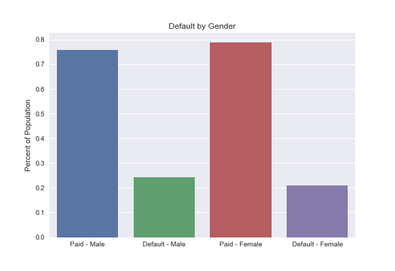
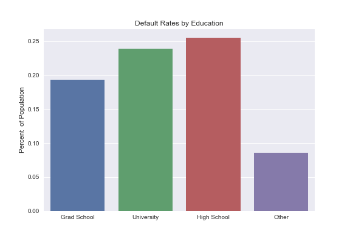
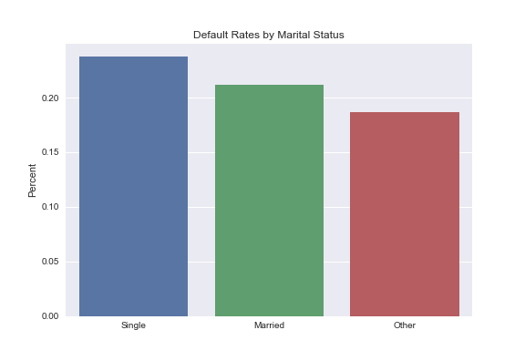
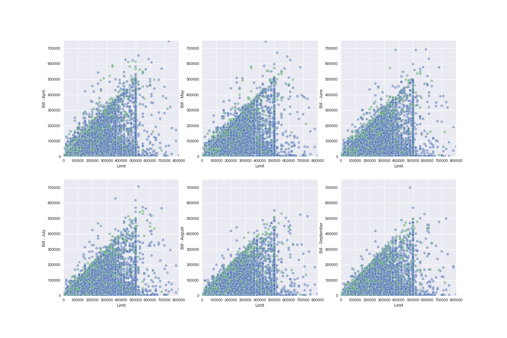
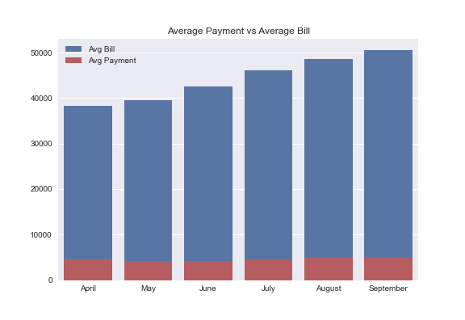

# Predicting Credit Card Defaults in Taiwan

**Author: Mitchell Krieger**

## Overview

To optimize returns, Banks must manage their risk when providing credit cards to customers. This project attempts to create a model that predicts if a client will or will not default on their loan. This project was a competition with classmates to see who could achieve the model with the best F-1 scores that predicts people who will default on a holdout dataset. My best model was a random forrest and had an F-1 score of .56 on the test portion of the dataset. When holdout competition dataset was run through the model it performed 3rd best in the class.


## Data:

This datset comes from the [UCI Machine Learning Repository](https://archive.ics.uci.edu/ml/datasets/default+of+credit+card+clients)

## Methods:

First, insights into trends in the data were found using exploratotry visual analysis. Based on these insights, additional features were engineered:

- Percentage Use of Limit
- High limit, greater than \$310,000 (above 85th percentile)
- Binary Late Payment or Not
- Binary Paid in full or not
- Percentage of Bill Paid
- Young (<30 years old)

Then dummy variables were added for categorical variables like sex, marital status and education level.

After spliting data into a train and test set, multiple classification techniques were attempted including:

- Logistic Regression
- Decision Trees & Radom Forest
- K Nearest Neightbors
- XGBoost

Additional models were attempted using ensemble voting.

## Exploratory Data Analysis

Default rates varied slightly based on gender, education level and marital status:

<p float="center">
  
  
   
</p>

The closer to a customer's bill was to their credit limit, the more defaults appeared (green dots along the $y=x$ line or the upper region of the triagnular area):



Similarly on average people were only likely to pay their card minimum (~ \$5000) which was much less than their card bill:



## Results

A random forest model after a tuning  with grid search was the best performer using the F-1 score. The best paramenters were:

| Hyperparameter  | Values  |
|---|---|
| Max Depth  | 6  |
| Max Features  | 7**  |
| Max Lead Nodes  |  35  |
| Max Samples | 0.75  |
| Min Sample Split | 25 |
| Num of Esitmators| 100 |

This model generated an F1 score of .56 on the test set.

## Conclusions

On the holdout set, this model came in 3rd place of 30 competitng models.

## Next Steps

Next steps are to:

- Tune models further and idenitfy better feature selection processes
- Add additional feature interactions and potentially polynomial features
- Conduct research on cultural and economic differences in Taiwan
 
## Repository Structure

```
├── data                      <- directory containing data used for project modeling
├── images                    <- directory containg images of plotting
├── Holdout.ipynb             <- Jupyter Notebook containing predictions of the best model on holdout test set.
├── bakeoff_instructions.md   <- instructions for the competition
├── defaults-in-taiwan.ipynb  <- Narrative Jupyter Notebook containing EDA and modeling processes
└── preds_Mitch_Krieger.csv   <- a csv file containing default predictions on a holdout set of data
